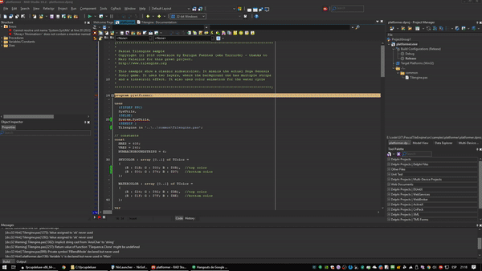
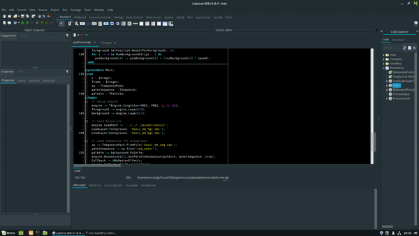
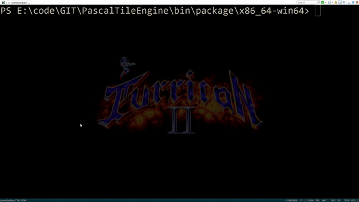
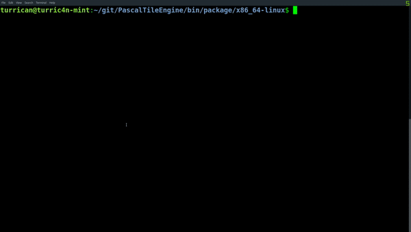

# PascalTilengine
[](https://www.gnu.org/licenses/old-licenses/lgpl-2.1.html)

## Delphi + Windows


## Lazarus + FPC + Linux


Pascal bindings for Tilengine 2D retro graphics engine 

*****************************************************************************
* Delphi/FreePascal Tilengine wrapper - Up to date to library version 2.1
* http://www.tilengine.org
* https://github.com/turric4n/PascalTileEngine
*****************************************************************************

Copyright (c) 2018 Enrique Fuentes (aka Turric4n) - thanks to Marc Palacios for
this great project.

Permission is hereby granted, free of charge, to any person obtaining a copy
of this software and associated documentation files (the "Software"), to deal
in the Software without restriction, including without limitation the rights
to use, copy, modify, merge, publish, distribute, sublicense, and/or sell
copies of the Software, and to permit persons to whom the Software is
furnished to do so, subject to the following conditions:

The above copyright notice and this permission notice shall be included in all
copies or substantial portions of the Software.

THE SOFTWARE IS PROVIDED "AS IS", WITHOUT WARRANTY OF ANY KIND, EXPRESS OR
IMPLIED, INCLUDING BUT NOT LIMITED TO THE WARRANTIES OF MERCHANTABILITY,
FITNESS FOR A PARTICULAR PURPOSE AND NONINFRINGEMENT. IN NO EVENT SHALL THE
AUTHORS OR COPYRIGHT HOLDERS BE LIABLE FOR ANY CLAIM, DAMAGES OR OTHER
LIABILITY, WHETHER IN AN ACTION OF CONTRACT, TORT OR OTHERWISE, ARISING FROM,
OUT OF OR IN CONNECTION WITH THE SOFTWARE OR THE USE OR OTHER DEALINGS IN THE
SOFTWARE.

# Contents
- [Features](#features)
- [Installing](#installing)
    - [Windows](#windows)
    - [Unix-like](#unix-like)
- [Performance](#performance)

# Features
* Written in portable Pascal (FPC and Delphi)
* LGPL v2.1 license: free for any project, including commercial ones
* Cross platform: available builds for Windows (32/64), Linux PC(32/64), Mac OS X and Raspberry Pi using FPC
* High performance: Wrapper is made using native lightweight OOP Pascal (no VM or garbage collector environment)

* Fully playable shooter example made in OOP 


# Requirements
As OpenSource project, I recommend to use FPC but is fine Delphi Community (Free) to compile too. Delphi has sightly 
better perfomance in Windows but FreePascal is a real multiarch. Firemonkey is not supported yet... if you want Android definetly 
go to FPC.

# Installing
Setup will checkout dependancies and will try to build everything to work with native library.

## Windows
```
> setup.cmd
```

## Debian-based linux
```
> sudo ./setup
```

# Performance
Our wrapper is near or equal performance as plain C.

```
Benchmark specs -> 
  Compiler : Delphi Tokyo 10.2 and Visual C 2017
  Architecture : x86-64 -O2
  OS : Windows 10 (1809)  
  CPU : I7700K @ 4.9GHZ
  RAM : 16 GB DDR4 @ 3200MHZ
```



```
Benchmark specs -> 
  Compiler : FPC 3.2 and GCC 8.2
  Architecture : x86-64 -O2
  OS : Linux MINT 19
  CPU : I7700K @ 4.9GHZ (Oracle VM VirtualBox for Windows)
  RAM : 4 GB DDR4 @ 3200MHZ
```


